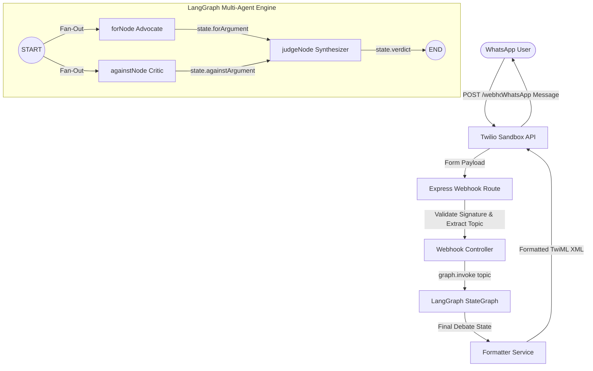

# WhatsApp Multi-Agent Debate System

A production-ready, stateless WhatsApp bot built with **Node.js**, **Express**, **LangGraph.js**, **LangChain Anthropic**, and **Twilio WhatsApp API**. It takes a user's decision or dilemma and returns a balanced, structured verdict generated by three orchestrated AI agents (**For**, **Against**, and **Judge**).

---

## 🏛️ Architecture & Agent Graph Flow



---

## 🛠️ Tech Stack

| Layer | Technology | Function |
|---|---|---|
| **Runtime** | Node.js (v20 LTS) | Async performance & standard server execution |
| **Framework** | Express.js | Minimalist HTTP routing & Twilio webhook listener |
| **Orchestration** | **LangGraph.js** | Explicit `StateGraph` modeling fan-out/fan-in parallel agent workflows |
| **LLM Integration** | **LangChain Anthropic** | Structured prompts & Claude 3.5 Sonnet agent calls |
| **Messaging Channel** | Twilio WhatsApp API | Real-time WhatsApp communication sandbox |
| **Validation** | Zod & Twilio SDK | Runtime environment validation & request signature security |
| **Logging** | Pino | High-speed structured JSON stream logging |
| **Testing** | Jest & Supertest | Zero-network unit testing & API integration test suite |

---

## 📂 Folder Structure

```
whatsapp-debate-bot/
├── src/
│   ├── index.js                     # Express app setup & server entrypoint
│   ├── routes/
│   │   └── webhook.route.js         # Routes POST /webhook & GET /health
│   ├── controllers/
│   │   └── webhook.controller.js    # Extracts request, invokes graph, returns TwiML
│   ├── services/
│   │   └── formatter.js             # Formats graph state to WhatsApp markdown & TwiML
│   ├── graph/
│   │   ├── state.js                 # LangGraph Annotation schema definition
│   │   ├── debateGraph.js           # StateGraph construction & node graph compilation
│   │   └── nodes/
│   │       ├── forNode.js           # Advocate node (arguments FOR)
│   │       ├── againstNode.js       # Critic node (arguments AGAINST)
│   │       └── judgeNode.js         # Synthesizer node (final verdict)
│   ├── middleware/
│   │   ├── validateTwilioRequest.js # Security middleware verifying X-Twilio-Signature
│   │   └── errorHandler.js          # Fallback error handler returning TwiML fallback
│   ├── config/
│   │   └── env.js                   # Zod environment variable parsing at startup
│   └── utils/
│       └── logger.js                # Pino structured logging wrapper
├── tests/
│   ├── debateService.test.js        # Graph topology & state flow unit tests
│   └── webhook.controller.test.js   # HTTP route & webhook integration tests
├── .env.example                     # Sample environment variable template
├── render.yaml                      # Render.com deployment manifest
├── package.json
└── README.md
```

---

## 🚀 Getting Started

### 1. Prerequisites
- Node.js >= 20.x
- Anthropic API Key (`ANTHROPIC_API_KEY`)
- Twilio Account (for WhatsApp Sandbox testing)

### 2. Installation
```bash
git clone https://github.com/your-repo/whatsapp-debate-bot.git
cd whatsapp-debate-bot
npm install
```

### 3. Environment Configuration
Copy `.env.example` to `.env` and fill in your credentials:
```bash
cp .env.example .env
```

```env
PORT=3000
NODE_ENV=development
ANTHROPIC_API_KEY=your_anthropic_api_key
TWILIO_ACCOUNT_SID=your_twilio_sid
TWILIO_AUTH_TOKEN=your_twilio_auth_token
DISABLE_TWILIO_VALIDATION=false
```

### 4. Running Locally
```bash
# Start development server with hot reloading
npm run dev

# Run test suite
npm test
```

### 5. Connecting to WhatsApp Sandbox
1. Expose your local port via ngrok:
   ```bash
   npx ngrok http 3000
   ```
2. Copy the HTTPS forwarding URL (e.g. `https://xxxx.ngrok-free.app`).
3. In [Twilio Console > WhatsApp Sandbox Settings](https://console.twilio.com/):
   - Set **"WHEN A MESSAGE COMES IN"** to `https://xxxx.ngrok-free.app/webhook` (HTTP POST).
4. Send a WhatsApp message to the sandbox number (e.g., `"Should I accept a job at a startup vs a big tech firm?"`).

---

## 🧪 Testing

The test suite runs using Jest with mocked LLMs and zero live API dependencies:

```bash
npm test
```

---

## ☁️ Deployment (Render)

This application is ready for free-tier deployment on Render or Railway using the included `render.yaml`:

1. Connect your GitHub repository to **Render**.
2. Select **New Web Service** -> **Blueprint**.
3. Render will automatically read `render.yaml` and configure `/health` as the uptime health check.
4. Add `ANTHROPIC_API_KEY`, `TWILIO_ACCOUNT_SID`, and `TWILIO_AUTH_TOKEN` in the Render Environment Variables tab.
5. Update your Twilio Sandbox webhook URL to `https://your-render-app.onrender.com/webhook`.

---

## 🗺️ Roadmap (v1 → v2)

- **MongoDB Memory**: Add LangGraph mongo checkpointer for thread history & follow-up questions.
- **WhatsApp Media Support**: Support voice notes via OpenAI Whisper audio transcribing before graph processing.
- **Per-User Rate Limiting**: Redis key-value rate limiting per phone number.
